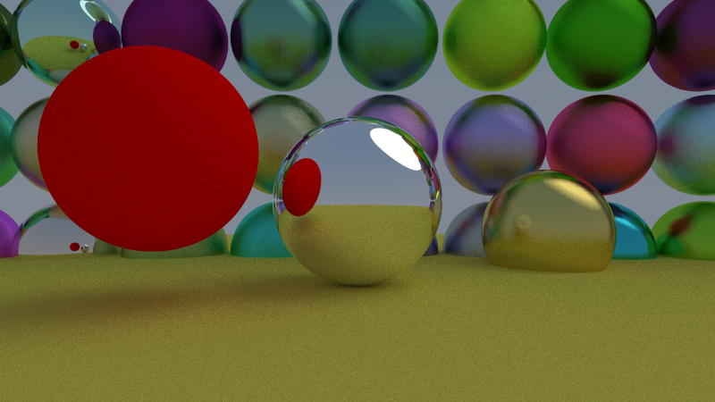

# Raytracing engine

A simple multithreaded path tracer written in modern c++.
I used the book [Raytracing in One Weekend](https://raytracing.github.io/) as a guide.

## Usage
Config:
Configure path tracer settings in config.h and setup the scene in main.cpp

Build:
`$ cmake -B build; cmake --build build`

Run:
`$ ./build/raytracer > img.ppm` 

